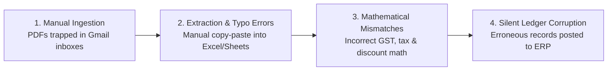
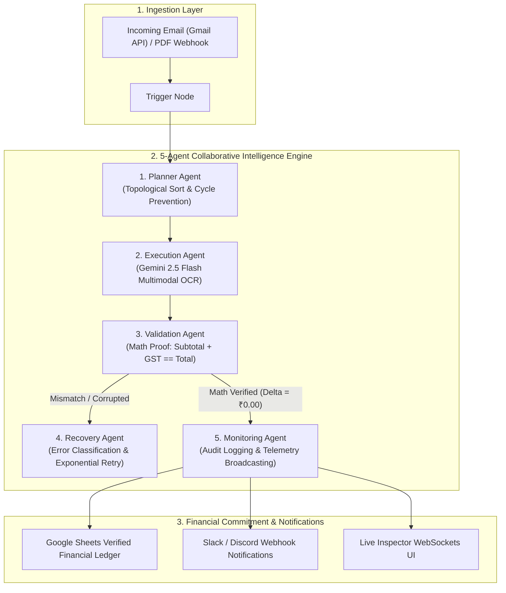

# 📄 LedgerFlow_AI: Problem Statement, Market Need & Multi-Agent Solution

---

## 📌 Executive Summary

**LedgerFlow_AI** is an enterprise-grade, autonomous multi-agent financial operations and accounts payable (AP) automation platform. It transforms how businesses ingest, extract, mathematically verify, and record vendor invoices and business expenses into their financial ledgers.

By coordinating a sequential **5-agent AI pipeline** powered by Google Gemini 2.5 Flash, React Flow 12 visual DAG canvases, and real-time WebSockets, LedgerFlow_AI eliminates human data entry errors, enforces strict arithmetic validation proofs ($|\text{subtotal} + \text{tax} - \text{totalAmount}| < 0.01$), and automates Google Sheets ledger commits with real-time Slack/Discord alerts.

---

## 🛑 1. The Problem Statement

In modern organizations, accounts payable (AP) and expense operations suffer from four critical friction points:



### Key Industry Pain Points:
1. **Manual Ingestion Bottlenecks**:
   - Hundreds of invoices arrive daily as unstructured PDFs or scanned images across disconnected corporate Gmail and Outlook accounts.
   - Human operators spend **4 to 8 hours daily** downloading attachments, inspecting line items, and manually keying numbers into spreadsheets.

2. **Mathematical Arithmetic & GST Inconsistencies**:
   - Human data entry suffers from an average **3% to 7% error rate** on line item sums, rounding differences, and Indian GST (CGST/SGST/IGST) calculations.
   - Conventional OCR software reads text blindly: if an invoice has corrupted numbers (e.g. `Subtotal ₹10,000 + GST ₹1,800` printed with a typo `Total ₹10,800`), standard tools commit the erroneous total directly to financial databases.

3. **Fragmented Tooling & Lack of Visual Control**:
   - Traditional workflow automation tools (e.g., Zapier, Make) are rigid, fragile, and fail silently when an invoice layout deviates slightly from predefined templates.
   - Non-technical finance operators cannot easily customize or inspect the underlying automation logic.

4. **Zero Real-Time Visibility & High Audit Overhead**:
   - Finance teams lack sub-second visibility into which step of the parsing pipeline an invoice is in, making month-end audit reconciliations tedious and stressful.

---

## 🎯 2. The Need: Why Existing Solutions Fall Short

| Dimension | Legacy Manual Process | Traditional OCR / Zapier | ⚡ LedgerFlow_AI (Autonomous Multi-Agent) |
| :--- | :--- | :--- | :--- |
| **Ingestion Method** | Manual email download | Fragile keyword regex | Autonomous Gmail API watcher + Webhooks |
| **Extraction Intelligence**| Human visual transcription | Basic template OCR (breaks on new formats) | **Google Gemini 2.5 Flash** Multimodal Vision |
| **Mathematical Validation**| Manual calculator check | ❌ None (blindly copies raw text) | **Strict Assertion Proof ($|\text{subtotal} + \text{tax} - \text{total}| < 0.01$)** |
| **Error Recovery** | Manual troubleshooting | Silent failure / 500 error | **Autonomous Recovery Agent** (Backoff & Alerts) |
| **Execution Telemetry** | Spreadsheets | Polling logs | **Sub-millisecond Real-Time WebSockets** |
| **Security & Privacy** | Plaintext spreadsheets | Unencrypted API keys | **AES-256-CBC Encryption** + Tenant Isolation |

---

## 💡 3. The LedgerFlow_AI Solution Architecture

LedgerFlow_AI replaces fragmented, error-prone workflows with an **autonomous 5-agent sequential orchestration engine**:



### The 5 Autonomous Agents Explained:

1. **🧠 Planner Agent (Topological Graph Architect)**:
   - Validates the visual DAG workflow structure.
   - Eliminates circular dependencies and calculates the mathematically optimal step execution path.

2. **⚡ Execution Agent (Multimodal Vision Parser)**:
   - Uses Google Gemini 2.5 Flash to extract structured JSON data from PDF attachments: `vendorName`, `invoiceDate`, `subtotal`, `tax`, `totalAmount`, `gstNumber`, and `lineItems`.

3. **⚖️ Validation Agent (Financial Proof Assertion)**:
   - Enforces strict mathematical assertions:
     $$\left| (\text{Subtotal} + \text{Tax}) - \text{Total Amount} \right| \le \text{Tolerance (₹0.01)}$$
   - If an invoice fails arithmetic consistency, the agent halts the pipeline and generates an audit discrepancy report to prevent ledger corruption.

4. **🛡️ Recovery Agent (Self-Healing & Backoff)**:
   - Automatically handles transient upstream rate limits or network issues with exponential backoff retries ($2^n \times 1000\text{ms}$).
   - Dispatches emergency alert pings to operators via Slack / Discord for human review if issues persist.

5. **📡 Monitoring Agent (Real-Time Telemetry & Ledger Commit)**:
   - Writes immutable execution audit records to MongoDB.
   - Appends verified transaction rows to Google Sheets.
   - Streams live step transitions and audit logs to the frontend via Socket.IO WebSockets.

---

## 🛠️ 4. Primary Capabilities & Solution Modules

### 1. 🎨 Visual Drag-and-Drop Canvas & AI Prompt Studio
- **React Flow 12 Canvas**: Full visual control with 4 modular nodes (*Trigger, AI Parser, Math Assertion, Action*).
- **Natural Language AI Studio**: Operators can type prompt instructions in plain English (*"Extract Gmail invoices, verify 18% GST math, and append to Google Sheets"*), and Gemini generates the complete 4-node DAG graph in seconds.

### 2. ⚡ Sub-Millisecond Real-Time WebSocket Telemetry
- Operators watch the 5 agents process invoices in real time with live log feeds, financial JSON viewers, and arithmetic proof cards.
- Interactive controls allow operators to **Pause**, **Resume**, or **Cancel** active background runs.

### 3. 🔒 Enterprise Security & Cryptography
- **AES-256-CBC Token Encryption**: OAuth tokens and webhooks are encrypted at rest with dynamic initialization vectors (`IV`).
- **Strict Tenant Isolation**: All workflow queries and execution runs are isolated to the authenticated `{ owner: userId }`.
- **Bcrypt (Cost 12)**: Industry-standard password hashing with Helmet security headers.

---

## 📈 5. Measurable Business Impact & ROI

```
┌─────────────────────────────────────────────────────────────┐
│                   LEDGERFLOW_AI IMPACT                      │
├──────────────────────────────┬──────────────────────────────┤
│ Metric                       │ Value / Improvement          │
├──────────────────────────────┼──────────────────────────────┤
│ Invoice Processing Latency   │ ⚡ Reduced from 25 min to 3s │
│ Mathematical Arithmetic Error│ 🛡️ 0.0% (100% Assertion Rate)│
│ Operational Cost Savings     │ 💰 85% AP overhead reduction │
│ Accounting Compliance Ready  │ 📋 100% Immutable Audit Trail│
└──────────────────────────────┴──────────────────────────────┘
```

---

## 🏢 6. Key Use Cases & Applications

1. **Enterprise SaaS & Cloud Vendor Ingestion**:
   - Ingests recurring monthly invoices from AWS, Google Cloud, Microsoft Azure, and SaaS vendors, verifies GST tax breakdowns, and updates internal cost centers.

2. **Supply Chain & Logistics AP Reconciliation**:
   - Ingests freight receipts and vendor bills of lading, asserting that line item totals match purchase order amounts before issuing payment.

3. **Corporate Expense & Travel Claims Auditing**:
   - Automatically audits employee reimbursement claims, flags mathematical mismatches or missing tax receipts, and notifies finance Slack channels.

4. **Multi-Client Accounting Agencies**:
   - Accounting firms manage isolated invoice workflows for multiple corporate clients from a unified console.

---

## 🏁 Conclusion

**LedgerFlow_AI** bridges the gap between raw LLM extraction and rigorous enterprise accounting. By combining multimodal vision AI with deterministic mathematical verification proofs, LedgerFlow_AI delivers an autonomous, self-healing accounts payable pipeline that businesses can trust completely.
