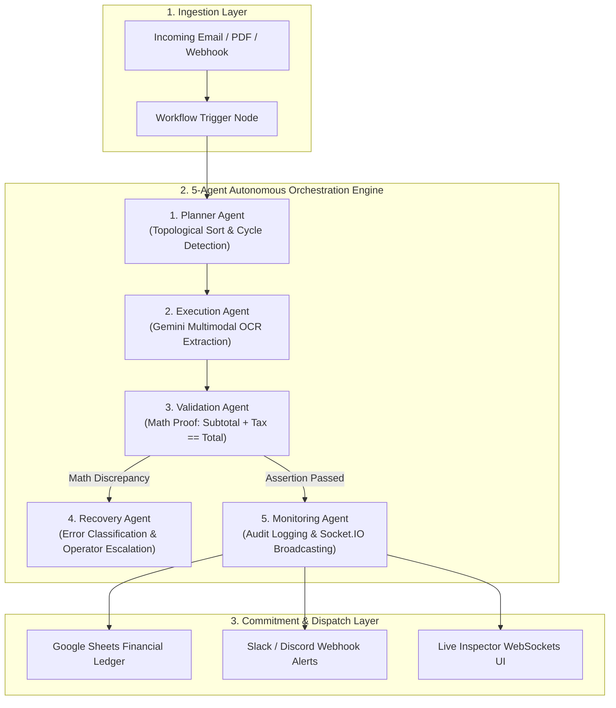

# ⚡ LedgerFlow_AI
### Autonomous Multi-Agent Invoice & Expense Operations Hub

[](https://opensource.org/licenses/MIT)
[](https://nodejs.org/)
[-black.svg)](https://nextjs.org/)
[](https://reactflow.dev/)
[](https://www.mongodb.com/atlas)
[](https://socket.io/)
[](https://ai.google.dev/)
[](https://en.wikipedia.org/wiki/Advanced_Encryption_Standard)

---

## 📖 Overview

**LedgerFlow_AI** is an enterprise-grade, autonomous multi-agent financial automation platform designed to eliminate manual data entry, human computation errors, and reconciliation delays in accounts payable (AP) workflows.

The system uses a sequential **5-agent pipeline** powered by Google Gemini and OpenRouter LLMs to intake incoming invoice PDFs, extract structured financial records, verify mathematical arithmetic formulas with strict assertion proofs ($|\text{subtotal} + \text{tax} - \text{totalAmount}| < 0.01$), and automatically commit verified ledger entries to Google Sheets while broadcasting audit alerts to Slack and Discord.

---

## 🎯 How to Use LedgerFlow_AI (Step-by-Step User Guide)

### 1. 🔑 Sign In & Operations Console (`/dashboard`)
1. Open the application at **`http://localhost:3000`** (or your live Vercel domain).
2. Click **"Create an account"** (`/register`) or sign in (`/login`).
3. View your live **Operations Console**:
   - **Active Automations**: Count of configured invoice workflows.
   - **Invoices Processed**: Real-time count of completed ledger transactions.
   - **Math Validation Rate**: Arithmetic assertion accuracy percentage ($100\%$).
   - **Autonomous Agents**: 5 active pipeline agents.

---

### 2. ✨ Method A: Generate an Automation via AI Prompt Studio (`/workflows/builder`)
1. Click **"AI Prompt Studio"** from the top header or navigation.
2. Type your financial automation requirement in natural language, for example:
   > *"Extract incoming vendor invoices from Gmail, parse line items and tax with Gemini, assert subtotal + tax equals total amount, and post verified records to Google Sheets with Slack notifications."*
3. Click **"Generate Autonomous DAG"**.
4. The AI architect will instantly construct a connected 4-node DAG graph with confidence scoring (`99%`).
5. Click **"Open in Interactive Canvas"** to inspect and customize the visual nodes.

---

### 3. 🎨 Method B: Visual Drag-and-Drop Canvas (`/workflows`)
1. Navigate to **Workflows** (`/workflows`) and click **"Create Workflow"**.
2. Click **"Canvas"** on any workflow card to enter the visual DAG editor.
3. **4 Custom DAG Nodes**:
   - 📥 **Trigger Node**: Set up Gmail search queries (`has:attachment filename:pdf invoice`) or webhook intake.
   - 🧠 **AI Parser Node**: Configure Gemini extraction schema (`vendorName`, `subtotal`, `tax`, `totalAmount`, `lineItems`).
   - ⚖️ **Logic Node**: Define financial formula assertions (`subtotal + tax == totalAmount`) and tolerance thresholds.
   - 📤 **Action Node**: Designate Google Sheets ledger targets and Slack / Discord notification channels.
4. Drag connection handles between nodes to define execution paths, and click **"Save Workflow"**.

---

### 4. ⚡ Running Executions & Live WebSocket Inspector (`/executions/[id]`)
1. Inside the workflow canvas, click the green **"Execute"** button (or click **"Run"** from the Workflows table).
2. You will be automatically redirected to the **Live Execution Inspector** (`/executions/[id]`).
3. Watch the **Live WebSocket Stream**:
   - The top status pill pulses **`Live WebSocket`** with real-time log events.
   - **Live Audit Logs Tab**: View timestamped agent transitions (Planner $\rightarrow$ Execution $\rightarrow$ Validation $\rightarrow$ Monitoring).
   - **Extracted Financial JSON Tab**: Inspect structured vendor, tax, and line item payloads.
   - **Mathematical Formula Integrity Tab**: Review arithmetic proof cards proving $|\text{subtotal} + \text{tax} - \text{totalAmount}| = 0.00$.
4. Use the **Pause**, **Resume**, or **Cancel** buttons to control active background worker runs on the fly.

---

### 5. 🔌 Connecting Third-Party Integrations (`/integrations`)
1. Navigate to **Integrations & OAuth** (`/integrations`).
2. **Google Workspace**:
   - Click **Connect Google Workspace**, enter your account email and ledger sheet name, or click **"Authorize via Google Sign-In"** to grant `gmail.readonly` and `spreadsheets` scopes.
3. **Slack Bot**:
   - Enter your Slack Incoming Webhook URL and channel (e.g. `#finance-alerts`).
4. **Discord Bot**:
   - Enter your Discord Webhook URL and channel name for escalation alerts.
5. Click **"Send Test Alert"** / **"Test Scopes"** to verify end-to-end encrypted dispatch.

---

### 6. ⚙️ Managing Settings & Roles (`/settings`)
1. Navigate to **Settings** (`/settings`).
2. View **Operator Profile** details, active JWT session status, and tenant isolation.
3. Review **Roles & Permissions** comparing **Operator** vs. **Admin** access.
4. Inspect live **Cryptographic Standards** (AES-256-CBC token encryption at rest, Bcrypt cost 12 password hashing) and **Infrastructure Diagnostics**.

---

## 🏛️ Multi-Agent Architecture



---

## 💻 Tech Stack

| Domain | Technology | Purpose |
| :--- | :--- | :--- |
| **Frontend Framework** | Next.js 16 (Turbopack, Pages Router) | High-performance server-rendered and static React UI |
| **Workflow Canvas** | `@xyflow/react` (React Flow 12) | Interactive node-based DAG workflow builder |
| **Styling & Icons** | Tailwind CSS + Lucide React | Glassmorphic dark theme (`#07090E`, `#0F1424`) |
| **State Management** | Zustand | Client-side reactive stores for canvas and auth state |
| **Backend Runtime** | Node.js (ES Modules) + Express | RESTful API server and multi-agent engine |
| **Real-Time WebSockets**| Socket.IO | Room-based execution event and log streaming |
| **Database** | MongoDB Atlas + Mongoose 8 | Document store with compound indices and timestamps |
| **AI / LLM Providers** | Google Gemini 2.5 Flash + OpenRouter | Multimodal extraction and prompt-to-graph synthesis |
| **Security & Cryptography**| AES-256-CBC, Bcrypt (Cost 12), Helmet | Token encryption at rest and request hardening |

---

## 📁 Repository Structure

```
LedgerFlow_AI/
├── client/                          # Next.js Frontend Application
│   ├── src/
│   │   ├── components/              # AppShell, ProtectedRoute, Canvas Nodes
│   │   │   ├── AppShell/            # Sidebar, Header, NotificationDrawer
│   │   │   └── nodes/               # TriggerNode, AiNode, LogicNode, ActionNode
│   │   ├── pages/                   # Next.js Pages Router
│   │   │   ├── index.js             # Landing Page
│   │   │   ├── dashboard.js         # Operations Console & Metrics
│   │   │   ├── login.js & register.js # Authentication
│   │   │   ├── settings.js          # Settings & Role Permissions
│   │   │   ├── workflows/           # Workflows List, Canvas, & AI Studio
│   │   │   ├── executions/          # History Table & Live Inspector
│   │   │   └── integrations.js      # OAuth & Webhook Integrations Hub
│   │   ├── services/                # Axios API client & Socket.IO client
│   │   └── store/                   # Zustand Workflow & Auth Stores
│   ├── vercel.json                  # Vercel Deployment Configuration
│   └── package.json
│
├── server/                          # Node.js Express Backend
│   ├── src/
│   │   ├── agents/                  # 5-Agent Pipeline Modules
│   │   │   ├── plannerAgent.js      # Topological DAG validation
│   │   │   ├── executionAgent.js    # Gemini document parsing
│   │   │   ├── validationAgent.js   # Arithmetic formula verification
│   │   │   ├── recoveryAgent.js     # Error handling & backoff
│   │   │   ├── monitoringAgent.js   # Audit logs & WebSocket emitter
│   │   │   └── orchestrator.js      # Sequential pipeline coordinator
│   │   ├── config/                  # DB, Environment, Socket.IO, & Queue
│   │   ├── controllers/             # Workflow, Execution, Auth, & Integration
│   │   ├── middleware/              # JWT Protect & Centralized Error Handler
│   │   ├── models/                  # User, Workflow, Execution, Log, Integration
│   │   ├── routes/                  # Express REST Route Handlers
│   │   ├── services/                # AI Service & Integration Service
│   │   └── utils/                   # AES-256-CBC Cryptographic Utilities
│   ├── scripts/
│   │   └── clean-mock-data.js       # Database sanitization utility
│   ├── tests/                       # Automated End-to-End Test Suites
│   └── package.json
│
├── spec.md                          # Full Architecture & Requirements Spec
├── LICENSE                          # MIT License
└── README.md
```

---

## 🛠️ Quick Start & Local Installation

### Prerequisites
- [Node.js](https://nodejs.org/) (v18.0.0 or higher)
- [MongoDB Atlas](https://www.mongodb.com/atlas) connection URI or local MongoDB daemon
- [Google AI Studio API Key](https://aistudio.google.com/) (Optional: for live Gemini extraction)

---

### Step 1: Clone the Repository
```bash
git clone https://github.com/Siddharth0317/LedgerFlow_AI.git
cd LedgerFlow_AI
```

---

### Step 2: Backend Setup
```bash
cd server
npm install
```

Create a `.env` file in `server/`:
```env
PORT=5000
NODE_ENV=development
CLIENT_URL=http://localhost:3000
MONGODB_URI=mongodb://localhost:27017/ledgerflow_ai
JWT_SECRET=your_jwt_secret_key_change_in_production
JWT_EXPIRES_IN=7d

# AES-256 Key for Token Encryption at Rest
CREDENTIAL_ENCRYPTION_KEY=agentflow_sec_994b7e8832a104c8f2b74051a8d0e729_2026

# AI LLM API Keys
GEMINI_API_KEY=your_gemini_api_key_here
OPENROUTER_API_KEY=your_openrouter_api_key_here

# Optional: Google Workspace OAuth
GOOGLE_CLIENT_ID=your_client_id.apps.googleusercontent.com
GOOGLE_CLIENT_SECRET=your_client_secret
GOOGLE_REDIRECT_URI=http://localhost:3000/integrations
```

Start the backend server:
```bash
npm run dev
# Server running on http://localhost:5000 (WebSockets active)
```

---

### Step 3: Frontend Setup
Open a new terminal window:
```bash
cd client
npm install
```

Create a `.env.local` file in `client/`:
```env
NEXT_PUBLIC_API_URL=http://localhost:5000/api
```

Start the Next.js development server:
```bash
npm run dev
# Client running on http://localhost:3000
```

---

## 🧪 Automated End-to-End Test Suites

The project includes an automated test runner validating all system layers across **40 assertions (100% Pass Rate)**:

```bash
# 1. Test Core Engine, Auth, Canvas CRUD, & Multi-Agent Execution (Phases 1-4)
node server/tests/e2e_phases1_4.test.js

# 2. Test AES-256 Token Encryption, OAuth, & Bot Webhooks (Phase 5)
node server/tests/e2e_phase5.test.js

# 3. Test Background Queue Workers, Socket.IO WebSockets, & Health (Phase 6)
node server/tests/e2e_phase6.test.js

# 4. Verify Next.js Frontend Production Build
cd client && npm run build
```

---

## 🌐 Production Deployment

### Backend (Render)
1. Link your GitHub repository to [Render](https://render.com).
2. Create a new **Web Service**:
   - **Root Directory**: `server`
   - **Build Command**: `npm install`
   - **Start Command**: `npm start`
   - **Health Check Path**: `/api/health`
3. Configure environment variables:
   `MONGODB_URI`, `JWT_SECRET`, `CREDENTIAL_ENCRYPTION_KEY`, `GEMINI_API_KEY`, `CLIENT_URL`.

### Frontend (Vercel)
1. Import the repository into [Vercel](https://vercel.com).
2. Set Root Directory to `client`.
3. Add Environment Variable: `NEXT_PUBLIC_API_URL = https://your-backend.onrender.com/api`.
4. Deploy!

---

## 🔐 Security & Data Isolation
- **Zero Secret Leakage**: Strict `.gitignore` policy excluding all `.env` files, build caches, and test artifacts.
- **AES-256-CBC Encryption**: All credentials and tokens stored in MongoDB are encrypted at rest with dynamic IVs.
- **Bcrypt (Cost 12)**: Passwords are automatically hashed prior to database persistence.
- **User Scoped Queries**: Every database query is strictly scoped to the authenticated `{ owner: req.user._id }`.
- **Helmet & CORS**: Enhanced HTTP response headers and origin whitelisting enabled.

---

## 📄 License

This project is licensed under the **MIT License** — see the [LICENSE](LICENSE) file for details.
